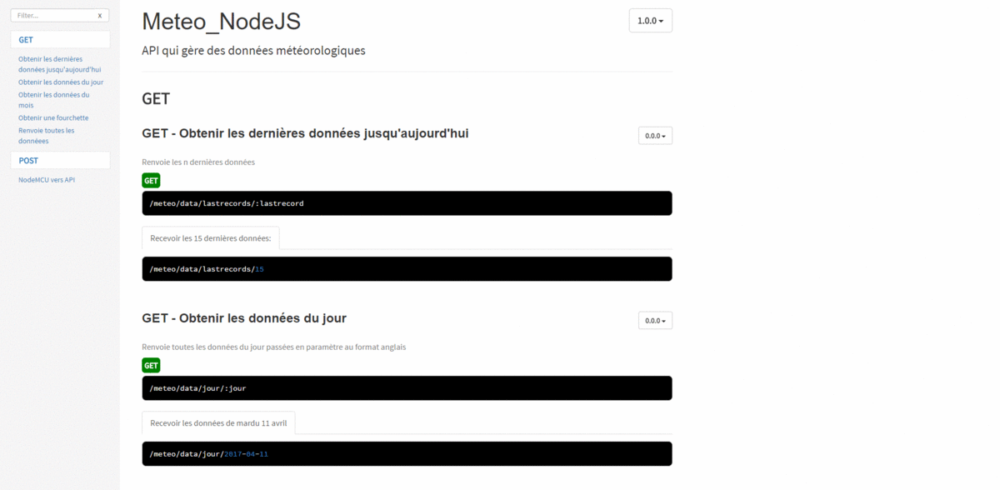

### Le but de ce projet est de créer une API qui va gérer différentes données météorologique capturées par un Node MCU. Pour cela j'utilise [NodeJS](https://nodejs.org/en/) et son mini framework [Express](http://expressjs.com/fr/)

Nous aurons besoin de plusieurs modules :

[Express](http://expressjs.com/fr/) pour gérer la partie rooting

[Mysql](https://www.npmjs.com/package/mysql) pour notre base de donnée

[Body-parser](https://www.npmjs.com/package/body-parser) afin de formater nos données

[Nodemon](https://www.npmjs.com/package/nodemon) petit utilitaire pratique pour relancer notre serveur à chaque modifications

Partons du principe que notre node MCU retourne des données au format `JSON`.

```json
{
  "temp": "25", //température
  "hum": "20" //humidité
}
```

Afin de récolter ces données nous utiliserons le modèle suivant comme vu dans la doc Express.

```javascript
app.post("/node", function(request, response) {
  response.send("POST request to homepage")
})
```

A l'intérieur nous n'aurons plus qu'a faire notre script.

Pour cela je créé une classe `Donnees` dans laquelle je définis une méthode static qui servira à ajouter les data pointées sur la route _ip:8000/node._

```javascript
class Donnees {
// On utilisera ici des méthodes static donc commune entre toutes les instances de la classe "Donnees"
    static insert(temp, hum, callback) {
            connection.query('INSERT INTO donnees SET temp = ?, hum = ?, time_ = ?', [temp, hum, new Date()], (err, result) {
                    if (err) throw err

                    callback(result)
    })
}
```

J'en profite pour y ajouter une date à l'aide du constructeur `new Date()`. De plus il est possible de rendre la requête mieux sécurisée; en regardant la doc de ce package il existe une méthode similaire aux requêtes préparées de PHP.

### POST

Maintenant que notre requête est faite il faut l'utiliser. Revenons à notre méthode Express `POST`. Il va maintenant falloir faire un appel de notre méthode insert dans la classe `Donnees` puis lui passer en paramètres nos data au format JSON.

Cela ce traduit par :

```typescript
// --- Route /node reçoit des data du nodeMCU---
app.post("/node/", (request, response) => {
  console.log(request.body)
  response.status(200) //Check status by nodeMCU

  //Interaction avec la BDD on envoit les donnees du node --
  let Donnees = require("./app/models/donnees")
  Donnees.insert(request.body["temp"], request.body["hum"], function() {
    // Appel de la la méthode insert dans la class Donnes
    console.log("envoie de donnees => DB") //checking logs
  })
})
```

### GET

De la même façon que nous avons utilisé POST avec l'objet app, on fait la même avec GET.

J'ai créé plusieurs routes GET différentes, en fonction des besoins de l'utilisateur, ici, je n'en montrerai qu'une mais il est toujours possible de voir l'intégralité du projet sur mon GitHub.

Nous avons donc ici une route dynamique qui enfonction de ce que l'utilisateur passe en paramètre retourne les *n* dernières data* :*

```javascript
//Choisir les derniers records en date:
app.get("/meteo/data/lastrecords/:lastrecords", (request, response) => {
  response.status(200)

  var lastrecords = request.params.lastrecords
  var Donnees = require("./app/models/donnees")
  Donnees.lastRecord(lastrecords, function(data) {
    return response.json(data)
  })
})
```

`'/meteo/data/lastrecords/:lastrecords'` est une route dynamique, c'est à dire qu'il est possible d'y insérer plusieurs variables qui vont pouvoir permettre à l'utilisateur de varier sa requête.

Ici `:lastrecords` fait référence à un nombre, si l'utilisateur veut les dix dernières données, il entrera '/meteo/data/lastrecords/10'. Pour accéder à ce paramètre il suffit d'utiliser `request.params.lastrecords` qu'on sauvegarde dans notre variable lastrecords qui sera passé en paramètre de notre méthode lastRecord dans la class `Donnees` :

```javascript
    static lastRecord(lastrecords, callback) {

        connection.query("SELECT * FROM donnees ORDER BY id DESC LIMIT " + lastrecords +"", (err, result) => {
            if (err) throw err

            callback(result)
        })
    }
```

`LIMIT` attend un nombre, on retrouve donc notre variable `lastrecords` qui servira à délimiter le nombre de champs en partant du dernier Id qui sera sélectionné.

### Callback

Vous avez du remarquer à plusieurs reprises l'utilisation d'une fonction dans un paramètre d'une autre fonction. C'est ce qu'on appelle un callback.

Revenons sur l'exemple lastrecords :

```javascript
Donnees.lastRecord(lastrecords, function(data) {
  return response.json(data)
})
```

Ici le callback est une fonction anonyme qui prend en paramètre `data`. Elle va se charger de récupérer le résultat (data) de la query lastRecord et ensuite on retourne cette même data au format JSON.

### Bonus

Il est possible de créer rapidement un template pour votre doc api avec [apidoc](http://apidocjs.com/). En fonction de vos décorateurs et selon un modèle précis, Apidoc va vous créer lui-même une documentation propre à votre api.

En exemple :



### Conclusion

Au final rien qu'en lisant la documentation d'Express pour les routes, Mysql pour la connexion et nos requêtes sql, 75% du boulot est fait.

Ce projet à été réalisé à deux, Clément Ballet pour la partie interface (ajax/tableau/graphique) et moi-même pour la partie back-end.

Vous pouvez retrouver l'intégralité de ce projet sur mon [GitHub](https://github.com/kev-landry/Meteo_NodeJS).
