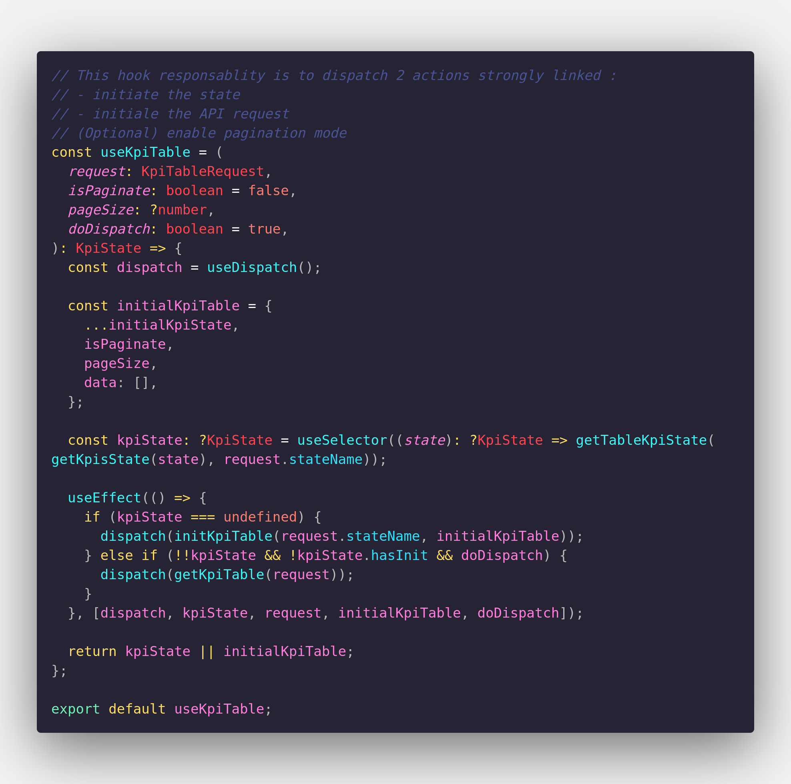

### Les Hooks React

## Qu'est ce qu'un hook ?

- Une simple fonction.
- Permet de manipuler l'état dans notre composant

### Les hooks de l'api React:

- useState()
- useEffect()
- useContext()
- etc

### Les custom hooks

Possibiliter de créer nos propre hooks:

## Pourquoi utiliser des hooks ?

- Les hooks permettent de réutiliser plus facilement la logique a état.
  Donc d'externaliser son code dans une fonction réutilisable par plusieurs composants.
- Moins de duplication de **code**
- Tester plus facilement ses fonctions
- Eviter l'empilement de 10K HOC (high order componant) et donc plein de couches inutiles
- Pour éviter d'utiliser des classes et se tourner plus vers une programmation fonctionelle.

### Règles

- Toujours au top **level** d'une fonction/composant
- Autant de hooks qu'on veut

### La démo

[Vous pouvez retrouver la démo que j'ai faite via ce repository](https://github.com/kev-landry/demo-hooks).
