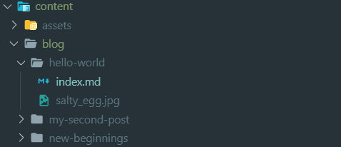

## Passer de Wordpress à Gatsby

Comme dit dans la partie 1 de notre tuto, mettre en place gatsby est rapide et relativement simple, nous aborderons ces 3 étapes:

- Migration de notre fichier .xml wordpress
- Mise en place de Gatsby
- Déploiementvia Netlify

### Migrer depuis wordpress

Pour cela il va nous falloir dans un premier temps exporter tous nos articles wordpress via son backoffice.

Ensuite j'ai utilisé [wordpress-export-to-markdown](https://github.com/lonekorean/wordpress-export-to-markdown) qui permet de convertir notre fichier .xml en fichier markdown .md.

```bash
git clone https://github.com/lonekorean/wordpress-export-to-markdown.git
cd wordpress-export-to-markdown
npm install
// copiez votre fichier .xml par exemple wordpress.xml
node index.js --input=wordpress.xml
```

N'oubliez pas de c/c votre .xml à la racine du repo cloné et de mettre le bon chemin/nom de fichier. Une fois fait tout vos articles convertis se trouveront dans le dossier `/output`.
Vous aurez aussi besoin de toutes vos images stockées dans votre `wp-content/uploads/**`. De base wordpress en fait différents formats genre thumbnails, à vous de faire le tri.
Pour l'instant pas besoin d'aller plus loin, passons à l’installation de notre projet gatsby.

### Setup son blog avec gatsby

Premièrement on installe de manière globale le CLI de gatsby:

```bash
npm install -g gatsby-cli
```

On créer un nouveau projet gatsby en utilisant [gatsby-starter-blog](https://github.com/gatsbyjs/gatsby-starter-blog), un template conçu spécialement pour notre besoin. Il inclut de base plusieurs plugins utiles ainsi que des settings appropriés pour la création d'un blog.

```bash
gatsby new mon-super-blog https://github.com/gatsbyjs/gatsby-starter-blog
```

On lance le serveur de développement:

```bash
cd mon-super-blog
gatsby develop
```


Vous n'avez plus qu'à vous rendre sur [http://localhost:8000/](http://localhost:8000/) pour voir le résultat.
Dans le screenshot au dessus on peut déjà voir qu'il y a "7 pages", notre template possède déjà quelques articles par défaut afin de vous donner une idée.

Maintenant que l'installation est complète copiez vos dossiers d'articles convertis précédemment en markdown vers `content/blog`. C'est là que vous pouvez stocker vos articles .md.
  

Par exemple en suivant cette structure au dessus il est possible de voir l'article hello-world en allant sur [http://localhost:8000/hello-world](http://localhost:8000/hello-world). Bien sûr vous êtes libre de suivre cette architecture ou de la changer dans `gatsby-config.js`.

Vous pouvez déjà commencer à personnaliser votre nouveau projet en allant éditer `gatsby-config.js`. Dans ce fichier vous y trouverez les **métadonnées** de votre site ainsi que la liste des différents plugins gatsby.

Dans `/content/assets/profile-pic.jpg` vous trouverez l'avatar de base utilisé en page d’accueil que vous êtes libre de changer.

Vous avez maintenant votre blog qui fonctionne en local il ne reste plus qu'à lui trouver un host !

### Héberger son blog avec Netlify

[Netlify](https://www.netlify.com/) est un hébergeur gratuit tout indiqué lorsqu'il s'agit de contenu statique. On peut lui distinguer plusieurs fonctionnalités sympa:

- Système d'intégration continue via git
- Un CDN puissant
- Possibilité de split-testing
- Configurer plusieurs environnements
- Certificat SSL

Tout d'abord initialisez un repo git dans votre projet:

```bash

git init
git add .
git commit -m "Initial commit"
git remote add origin https://github.com/kevin/mon-super-blog.git
git push -u origin master

```

Créez un compte netlify puis allez dans votre interface par défaut et cliquez sur "new site from Git":

Vous devrez autoriser netlify à accéder à votre github/lab et lui indiquer quel répertoire il peut utiliser. Dernière étape, spécifiez la commande à exécuter afin de build votre site gatsby et l'emplacement de son dossier une fois le build terminé.

Plus qu'à cliquer sur **deploy site** pour que votre blog soit à porté de click de millions de gens !
À noter que par défaut votre site sera rebuild à chaque push sur votre origin master, libre à vous de configurer tout ça différemment.

Pour aller plus loin dans le développement de votre site je vous invite à [assimiler le fonctionnement de React](https://reactjs.org/tutorial/tutorial.html) et de [Gatsby avec GraphQl](https://www.gatsbyjs.org/tutorial/).

Bravo ! Avec tout ça il ne vous reste plus qu'à mettre par écrit toutes vos ideés d'articles !
