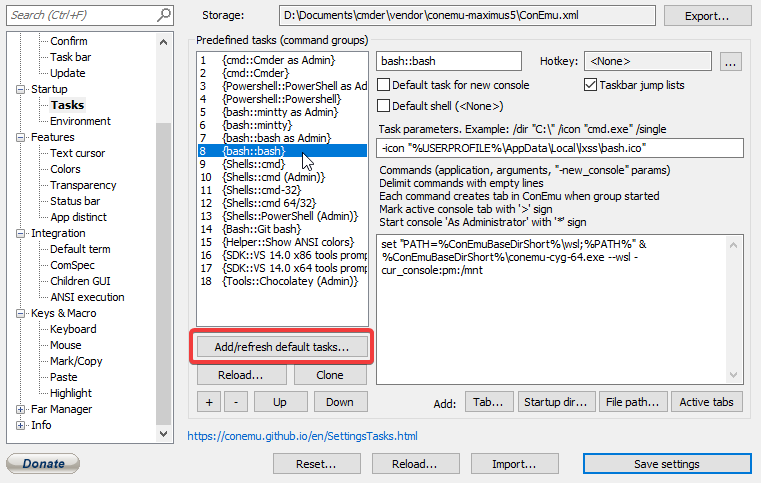

**Petite présentation de mon environnement de travail sur Windows.**

### Terminal

J'utilise l'émulateur console [Cmder](http://cmder.net/) en tant que terminal.

Il réunit plusieurs fonctionnalités sympa et en plus est portable, on peut donc l'utiliser sur plusieurs machines sans problèmes afin de retrouver ses propres settings.

On retrouve dessus la plupart des commandes bash (ls, touch, grep, etc...) et aussi l'intégration de git/ssh très utile.

En plus de cela il est possible de le customiser de façon assez avancé pour en faire notre terminal idéal :

- Ajouter des alias (voir mon article)
- Changer le thème couleur
- Définir les raccoucis
- Choisir quel CLI (Command Line Interface) utiliser dans votre terminal cmder

Sur ce dernier point concernant le CLI il y en a plusieurs à disposition, vous pouvez y accéder via `Settings -> Startup -> Tasks` :

On y retrouve forcément cmder, mais aussi le shell de base de windows (à éviter), powershell, il est même possible de faire en sorte d'utiliser le bash de linux.

En effet vous pouvez activer le mode développeur puis cochez **Sous-système Windows pour Linux** afin d'avoir accès à un des environnements linux disponible.

Une fois coché redémarrez le pc pour terminer l'installation.

Ensuite cliquez sur **Add/refresh default tasks** toujours dans l'onglet Tasks :

Cmder va se charger lui-même de trouver le bash.exe et d'en définir le chemin.

Il ne reste plus qu'à sélectionner Bash dans l'onglet **Startup :**

Et voilà ! Vous pouvez dès à présent profiter de cet environnement sans avoir à passer par une machine virtuelle ou un boot. A noter qu'il existe pour le moment 5 distributions linux disponibles.

Cela termine la partie Cmder !

### Browser

J'utilise **chrome** en tant que navigateur et surtout son puissant [devtools](https://developers.google.com/web/tools/chrome-devtools/) (F12) que ce soit pour inspecter une interface, débugger du javascript, voir les requêtes échangées.

Avec quelques plugins utiles :

- [Wappalyzer](https://www.wappalyzer.com/download) pour check les technos utilisées sur un site.
- [Clear Cache](https://chrome.google.com/webstore/detail/clear-cache/cppjkneekbjaeellbfkmgnhonkkjfpdn) afin d'avoir un vrai refresh avec plus de contrôle sur les data effacées.
- [Postman](https://chrome.google.com/webstore/detail/postman/fhbjgbiflinjbdggehcddcbncdddomop) (must have) qui permet de tester des api de façon assez poussé, avec gestion de profil, token...
- [CSS Peeper](https://csspeeper.com/) pour check le style d'un site, voir les codes couleurs, les images etc...

A noter que la [developper dev edition](https://www.mozilla.org/fr/firefox/developer/) de firefox est aussi bien pensée et n'a plus les problèmes de lenteur qu'il a pu avoir dans le passé. Je l'ai d'ailleurs utilisé pendant la création de mon thème vu qu'il dispose d'outils pour la conception et la création de grilles CSS (css grid).

### Éditeur de code

Visual studio est mon éditeur préféré. Développé par la team Microsoft et open source, il est super léger, rapide et possède une tonne de plugins à sa disposition.

Plugins que j'utilise :

- [Material theme](https://marketplace.visualstudio.com/items?itemName=Equinusocio.vsc-material-theme) comme thème custom
- [Beautify](https://marketplace.visualstudio.com/items?itemName=HookyQR.beautify) qui permet de formater son code
- [ES6 code snippets](https://marketplace.visualstudio.com/items?itemName=xabikos.JavaScriptSnippets)
- [Remote FS](https://marketplace.visualstudio.com/items?itemName=liximomo.remotefs) pour utiliser VS Code sur un serveur(remote)
- [TSLint](https://marketplace.visualstudio.com/items?itemName=eg2.tslint) vu que j'utilise Angular et son typescript
- [Auto close tag](https://marketplace.visualstudio.com/items?itemName=formulahendry.auto-close-tag)
- [Debugger for Chrome](https://marketplace.visualstudio.com/items?itemName=msjsdiag.debugger-for-chrome)

### Environnement serveur local

En fonction du projet du moment soit j'utilise Laragon en attendant d'être capable de me créer mon propre environement sur Docker.

Quelques fonctionnaylités sympa avec Laragon :

- Possibilité d'utiliser apache/nginx, mysql/mongoDB, php/nodejs
- Création auto de pretty urls
- [Création rapide de projets](https://laragon.org/docs/quick-app.html) suivant le framework/CMS (laravel, symfon, wordpress)
- Gère le SSL

Soit j'utilise WSL2 qui est maintenant possible d'utiliser sur w10 comme vu précédemment avec la configuration de cmder.
