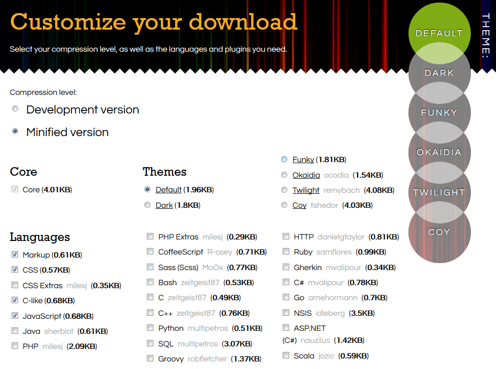

## Mettre en valeur son code avec Prism.js

Après avoir essayé plusieurs plugins wordpress "code snippet", j'ai constaté que la plupart ne me convenaient pas, ou alors étaient outdated.

Comme je compte utiliser ces snippets tout au long de mes futurs articles, je me suis dis pourquoi ne pas assembler mon propre éditeur de snippet !

Exemple type de ce qu'on veut arriver à faire :

```css
/* Code blocks */
pre[class*="language-"] {
  padding: 1em;
  margin: 0.5em 0;
  overflow: auto;
  border-radius: 0.3em;
}
```

A savoir qu'il est possible de tout simplement utiliser les balises `pre` et `code`, suivant votre thème, le résultat peut vous convenir. Il y a aussi des sites comme _[Github Gist](https://gist.github.com/)_ pour préformater son code comme ceci :

<script src="https://gist.github.com/kev-landry/8417101bc1650e4c2290590fc84b1aed.js"></script>

L'inconvénient c'est qu'à force d'insérer tous ces liens javascripts les pages prennent de plus de temps à charger.

---

Pour notre méthode nous utiliserons des librairies javascripts afin d'intégrer notre code. Il en existe plusieurs [highlight.js](https://highlightjs.org/), [rainbow](https://craig.is/making/rainbows), [google prettify](https://github.com/google/code-prettify) ou encore [prism.js](http://prismjs.com/).

Personnellement j'utilise Prismjs avec son thème _okaidia._

Dans la partie [downloads](http://prismjs.com/download.html) vous pouvez customiser votre package avec au choix, langages, thèmes, plugins :



Une fois les deux fichiers prism.css et prism.js téléchargés, placez les dans le dossier de votre thème,  le chemin peut changer suivant votre config, pour ma part il se trouve dans: \_`<wordpress>/wp-content/themes/<mon-thème>/assets`\_et suivant leur extension soit dans le dossier js ou css.

On doit maintenant faire en sorte que notre wordpress charge ces deux fichiers, nous allons devoir créer une fonction php dans notre fichier "function.php" à la racine de notre thème.

En allant fouiller la doc wordpress, deux pages nous aident pour la création de cette fonction, [including CSS & Javascript](https://developer.wordpress.org/themes/basics/including-css-javascript/) et [un index toutes les fonctions de base](https://codex.wordpress.org/Function_Reference).

Suivant [les exemples](https://developer.wordpress.org/themes/basics/including-css-javascript/#combining-enqueue-functions) trouvés dans cette doc on arrive à :

```php

// Notre fonction qui nous sert à charger nos deux nouveau fichiers:
function add_prism() {
// On link notre prism.css
wp_enqueue_style( 'prism_css', get_template_directory_uri(). '/assets/css/prism.css', array(),
DEVKICK_VERSION, 'all' );
// On link notre prism.js
wp_enqueue_script( 'prism', get_template_directory_uri(). '/assets/js/prism.js', array(),
DEVKICK_VERSION, true );
}
// Le call à notre fonction
add_action('wp_enqueue_scripts', 'add_prism');

```

De cette façon nous n'avons pas besoin de link prism.css  dans notre `header` ou de .js en bas de `body`.

Maintenant vous pouvez utiliser vos balises pre et code et la synthax se fera automatiquement sans avoir besoin de passer par d'autres sites tiers!

Vous pouvez aussi vous amusez à changer le style de vos balise dans le prism.css, perso j'ai juste changé le border-radius et assombri le background-color :

```css
/* Code blocks */
pre[class*="language-"] {
  padding: 1em;
  margin: 0.5em 0;
  overflow: auto;
  border-radius: 0.1em; // de 0.3em ) 0.1em
}
:not(pre) > code[class*="language-"],
pre[class*="language-"] {
  background: #20201b;
}
```

---

**Vous êtes maintenant paré pour mettre en valeur votre code dans vos articles sans dépendre de plugins ou de sites externes**
